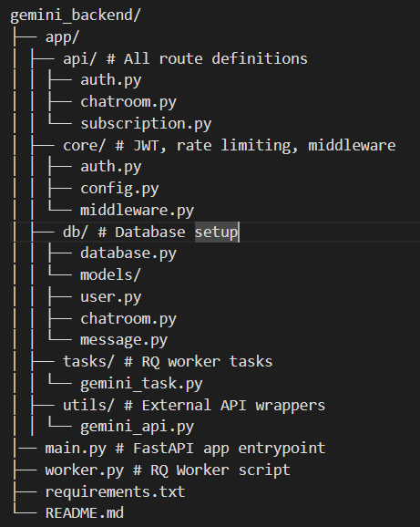

# Gemini Backend - Chatroom App with Gemini AI, Stripe Subscriptions, and FastAPI

This is a full-featured backend system inspired by Google's Gemini, built using **FastAPI**, **PostgreSQL**, **Redis + RQ**, **Stripe**, and **Google Gemini API**. The app supports user authentication via OTP, chatroom-based messaging with Gemini AI replies, caching, rate-limiting, and subscription management with Stripe.

---

## 🔧 Tech Stack

- **Backend**: FastAPI
- **Database**: PostgreSQL
- **Queue**: Redis + RQ
- **Auth**: OTP-based login with JWT
- **Payments**: Stripe (sandbox mode)
- **AI**: Google Gemini API
- **Caching**: Redis
- **Rate Limiting**: Daily cap for Basic users
- **Deployment**: Docker-compatible

---

## 📁 Project Structure




---

## ✅ Features

### 🔐 Auth

- `POST /auth/send-otp`: Send OTP to email (mocked).
- `POST /auth/verify-otp`: Verify OTP and get JWT token.
- `POST /auth/signup`: Signup new users.
- `POST /auth/forgot-password`: Send OTP for reset.
- `POST /auth/change-password`: Change password (auth required).

### 🧑‍💻 User

- `GET /user/me`: Get authenticated user details.

### 💬 Chatrooms & Messaging

- `POST /chatroom`: Create chatroom.
- `GET /chatroom`: Get all chatrooms (cached per user for 5 mins).
- `GET /chatroom/{id}`: Get chatroom details.
- `POST /chatroom/{id}/message`: Send message → queues Gemini AI reply using RQ.

### 🤖 Gemini AI Integration

- Uses Google Gemini API to generate replies.
- Replies are stored in DB asynchronously via Redis queue.

### 💸 Stripe Subscription

- `POST /subscribe/pro`: Creates Stripe Checkout session.
- `POST /webhook/stripe`: Handles subscription success/failure.
- `GET /subscription/status`: Check if user is Basic or Pro.

### 📉 Rate Limiting

- Basic users: Max 5 messages per day.
- Pro users: Unlimited usage.
- Enforced via middleware on `/chatroom/{id}/message`.

---

## 🧪 How to Test

### 1. Install dependencies

```bash
pip install -r requirements.txt
```
### 2. Start Redis (Docker recommended)

```bash
docker run -p 6379:6379 redis
```

### 3. Run FastAPI server

```bash
uvicorn app.main:app --reload
```

### 4. Start RQ Worker

```bash
python worker.py
```
## 🔑 Environment Variables
Create a .env file or set env vars manually:
```bash
JWT_SECRET_KEY=your_jwt_secret
GOOGLE_API_KEY=your_gemini_api_key
STRIPE_API_KEY=your_stripe_secret_key
STRIPE_WEBHOOK_SECRET=your_stripe_webhook_secret
FRONTEND_URL=http://localhost:3000
```

## 📌 Design Decisions

✅ JWT in Authorization header (Bearer <token>)

✅ Consistent JSON responses with appropriate status codes

✅ Token auth & error handling middleware

✅ Caching applied to GET /chatroom using Redis (per user)

✅ Rate limit: Basic users limited to 5 messages/day

✅ Gemini API integrated via google.generativeai SDK
